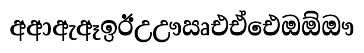
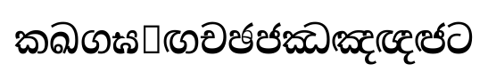
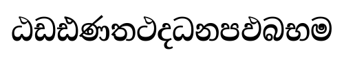

# Dingiri Manika · ඩිංගිරි මැණිකා

An old-world Sinhala serif typeface — a tribute to a grandmother and to the
letterpress era that printed Sri Lankan books and newspapers.

**Four weights:** Regular · SemiBold · Bold · Display





## Download

| Format | Files |
|---|---|
| TTF (install on your computer) | `fonts/DingiriManika-*.ttf` |
| WOFF2 (for websites) | `fonts/DingiriManika-*.woff2` |

Get the latest bundle from the [Releases](../../releases) page.

## Use on a website

```css
@font-face {
  font-family: 'Dingiri Manika';
  src: url('DingiriManika-Regular.woff2') format('woff2');
  font-weight: 400;
}
```

## What's special

- **Heritage voice** — high-contrast serifed letterforms in the spirit of
  19th-century Sinhala press type.
- **Disambiguation** — the confusable pairs that plague every Sinhala font
  (ඨ/ට, ථ/ත, ඵ/ප, ඡ/ච, ඝ/ග, the vowel-sign set) carry enlarged
  distinguishing marks. See `docs/specimen.html` for the pair comparisons.
- **Full shaping** — conjuncts (ශ්‍රී විද්‍යාලය චර්ය්‍ය), repaya, and all
  vowel signs render correctly out of the box.

## License

[SIL Open Font License 1.1](OFL.txt). Dingiri Manika derives from Noto Serif
Sinhala (The Noto Project Authors, OFL). "Dingiri Manika" is a Reserved Font
Name — modified versions must use a different name.
